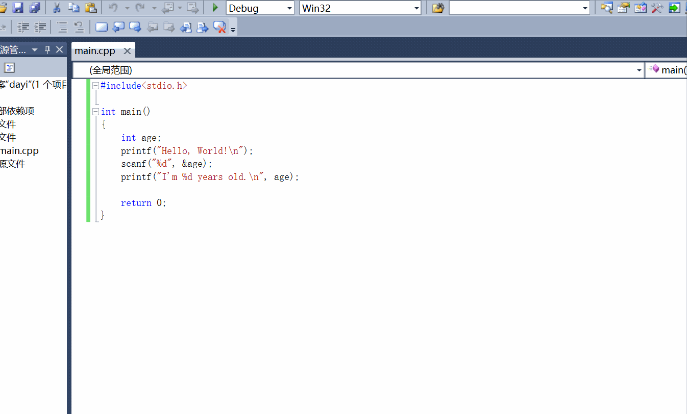

## 1. 三大结构

### 1.0 C语言程序框架

```c
#include<stdio.h>

int main()
{
    // 这儿输入要实现的功能
    return 0;
}
```

### 1.1 顺序结构

```c
#include<stdio.h>

int main()
{
    int score;

    printf("Hello, boy!\n");
    printf("Tell me you score:\n");

    scanf("%d", &score);
    printf("%d is great!\n", score);

    return 0;
}
```



### 1.2 分支结构

关键字

- if (必不可少)
- else

#### 1.2.1 单分支结构

```c
#include<stdio.h>

int main()
{
    int score;

    printf("Hello, boy!\n");
    printf("Tell me you score:\n");

    scanf("%d", &score);

    if(score >= 90)
        printf("you get A!\n", score);

    return 0;
}
```

#### 1.2.2 双分支结构

```c
#include<stdio.h>

int main()
{
    int score;

    printf("Hello, boy!\n");
    printf("Tell me you score:\n");

    scanf("%d", &score);

    if(score >= 90)
        printf("you get A!\n", score);
    else
        printf("Work hard.\n");

    return 0;
}
```

条件后如果是多条语句，要用```{}```括起来

```c
#include<stdio.h>

int main()
{
    int score;

    printf("Hello, boy!\n");
    printf("Tell me you score:\n");

    scanf("%d", &score);

    if(score >= 90)
    {
        printf("you get A!\n", score);
        printf("Great!\n");
    }
    else
    {
        printf("Work hard.\n");
    }

    return 0;
}
```

#### 1.2.3 多分支结构

```c
#include<stdio.h>

int main()
{
    int score;

    printf("Hello, boy!\n");
    printf("Tell me you score:\n");

    scanf("%d", &score);

    if(score >= 90)
    {
        printf("you get A!\n", score);
        printf("Great!\n");
    }
    else if(score >= 80)
    {
        printf("you get B!\n", score);
    }
    else if(score >= 70)
    {
        printf("you get C!\n", score);
    }
    else
    {
        printf("Work hard.\n");
    }

    return 0;
}
```

#### 1.2.3 多分支结构——switch语句

关键字

- switch - case (必不可少)
- break
- default
  
```c
#include<stdio.h>

int main()
{
    int score;

    printf("Hello, boy!\n");
    printf("Tell me you score:\n");

    scanf("%d", &score);

    switch(score / 10)
    {
        case 10:
        case 9:
            printf("you get A!\n", score);
            break;
        case 8:
            printf("you get B!\n", score);
            break;
        case 7:
            printf("you get C!\n", score);
            break;
        default:
            printf("Work hard.\n", score);
    }

    return 0;
}
```

<!-- ```flow
st=>start: 开始
op=>operation: My Operation
cond=>condition: Yes or No?
e=>end
st->op->cond
cond(yes)->e
cond(no)->op
&``` -->

### 1.3 循环结构

- for
- while
- do-while

#### 1.3.1 for 循环

一般形式

```c
for(expr1; expr2; expr3)
{
    statement;
}
```

```expr1``` : 初始化表达式

```expr2``` : 判断表达式

```expr3``` : 更新表达式

```statement``` : 循环语句

```flow
st=>start: begin
en=>end: end
expr1=>operation: expr1
expr2=>condition: expr2
expr3=>operation: expr3
statement=>operation: statement

st->expr1->expr2
expr2(no)->en
expr2(yes)->statement->expr3
expr3->expr2
```

for 常用于确定次数的循环

```c
#include<stdio.h>

int main()
{
    int n, x, sum=0;
    scanf("%d", n);
    for(int i=0; i<n; i++)
    {
        scanf("%d", &x);
        sum += x;
    }
    printf("Sum = %d", sum);

    return 0;
}
```

#### 1.3.2 while 循环

一般形式

```c
while(expr)
{
    statement;
}
```

```flow
st=>start: begin
end=>end: end
expr=>condition: expr
statement=>operation: statement

st->expr
expr(yes)->statement->expr
expr(no)->end
```

```c
#include<stdio.h>

int main()
{
    int x, sum=0;
    scanf("%d", &x);
    while(x>=0)
    {
        sum += x;
        scanf("%d", &x);
    }
    printf("Sum = %d", sum);

    return 0;
}
```

#### 1.3.3 do-while 循环

一般形式

```c
do{
    statement;
}
while(expr);
```

```flow
st=>start: begin
end=>end: end
expr=>condition: expr
statement=>operation: statement

st->statement->expr
expr(yes)->statement
expr(no)->end
```

```c
#include<stdio.h>

int main()
{
    int x, sum=0;

    do{
        scanf("%d", &x);
        sum += x;
    }
    while(x>=0);
    sum -= x;

    printf("Sum = %d", sum);

    return 0;
}
```

#### 1.3.4 break语句

跳出当前循环


## 二、PTA习题讲解

## 三、在线答疑
